## 快速生成Vue專案

### 開發環境建立
- 系統全域安裝Vue CLI，以便可快速建立Vue專案
> 安裝Vue CLI之前，請先確保，以有安裝[Node.js](https://nodejs.org/en/)

```bash
    # 最新、且穩定版本
    # 若無法安裝，請在npm前面加上`sudo`
    $ npm install -g @vue/cli

    # 安裝後，可輸入以下指令查看其版本，確認已安裝完成
    $ vue --version

    # 未來需要更新時，請輸入以下指令
    # 若無法更新，請在npm前面加上`sudo`
    $ npm update -g @vue/cli
```

### Vue專案建立
1. 創建專案名
```bash
$ vue create [專案名]
```
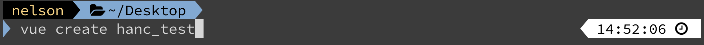

2. 專案預選設定
> 第一次安裝創建，請選擇「Manually select features」
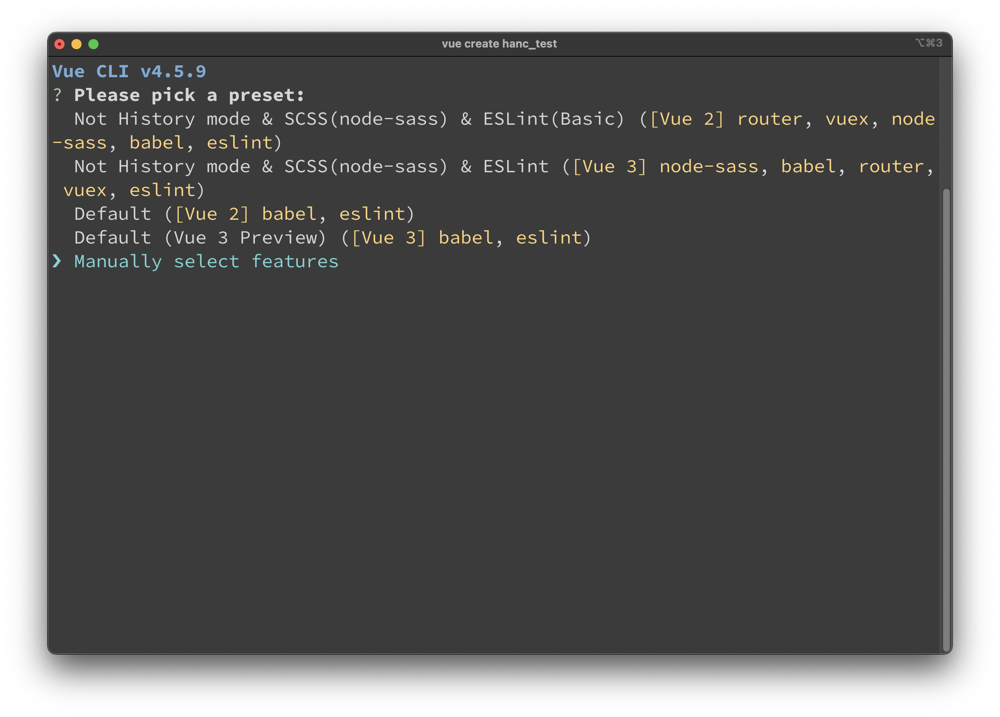

接下來跟著一步一步選擇，請按「空白鍵」做選擇，下一步請按「Enter」  
- 選擇features: 
    - Choose Vue Version
    - Babel
    - Router
    - Vuex
    - CSS Pre-processesors
    - Linter / Formatter
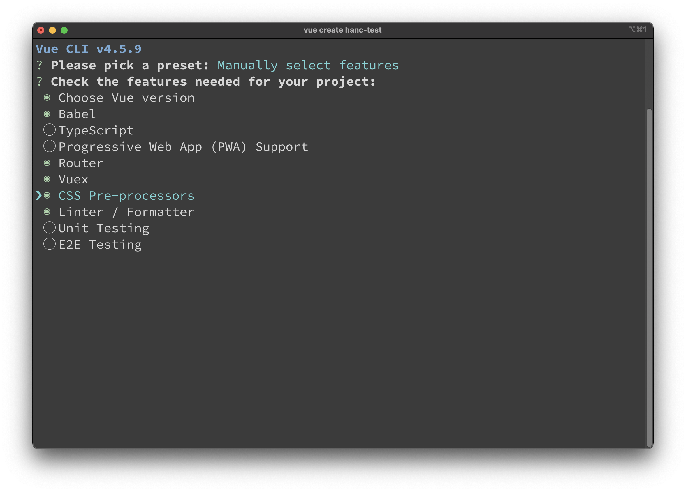
- 各功能簡介 
    - Babel: 
    - TypeScript: 靜態類型的JavaScript，開發時有效防止許多潛在的執行錯誤
    - Progressive Web App (PWA) Support: 透過各種技術及設計的優化，並保留網頁的優勢，藉此做到最好的使用者體驗 => 徹底改善用戶體驗 ([參考網站](https://ithelp.ithome.com.tw/articles/10186584))
    - Router: 於Vue中，當需要切換不同頁面時，則需要向專案註冊路徑
    - Vuex: Vue狀態管理工具、可宣告全域使用變數及函式
    - CSS Pre-processors: CSS預處理器，適合用於開發大型專案、多人協同，更能發揮它在可維護性上的效果，可透過變數統一定義全站樣式。
    - Linter / Formatter:  使用ESLint來規範程式碼，編譯時會嚴格檢查語法、報錯
    - Unit Testing: 單元測試，可單獨測試一項功能，例如可使用jest去編寫其測試代碼
    - E2E Testing: End to End 測試，例如使用cypress，可以自動模擬使用者操作

- 選擇Vue版本 - 3.x版本
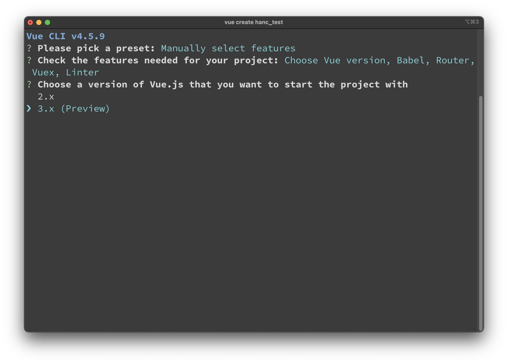

- No History mode
> 差別1: 使用History模式，於url不會看到#字號，例如首頁應為 `localhost:8080`，若沒有設置History模式，則會看見`localhost:8080/#/`，跳至其它頁面會呈現這樣`localhost:8080/#/about`  
  

> 差別2: 更改url時，No History Mode，頁面不會重新加載，例如原about網址應為`localhost:8080/#/about`，若更改為`localhost:8080/test#/about`，則會停留在原頁面。而History模式下，原應為`localhost:8081/about`，若改為`localhost:8081/test/about`，則會跳轉至空白頁面。

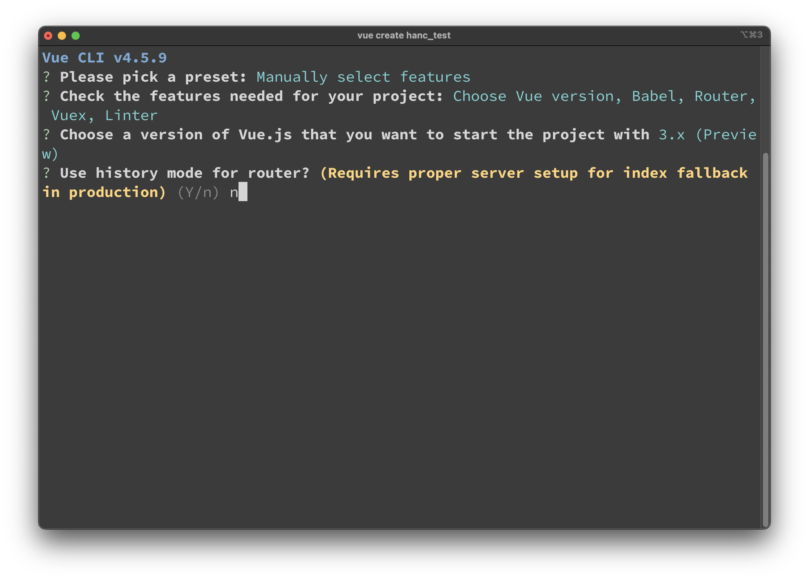

- 擇選CSS預處理器 - Sass/SCSS(with node-sass)
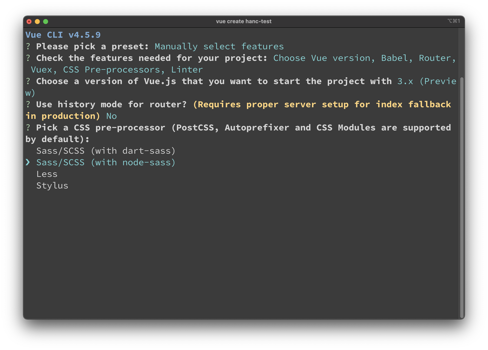

- 選擇 Linter / Formatter 配置
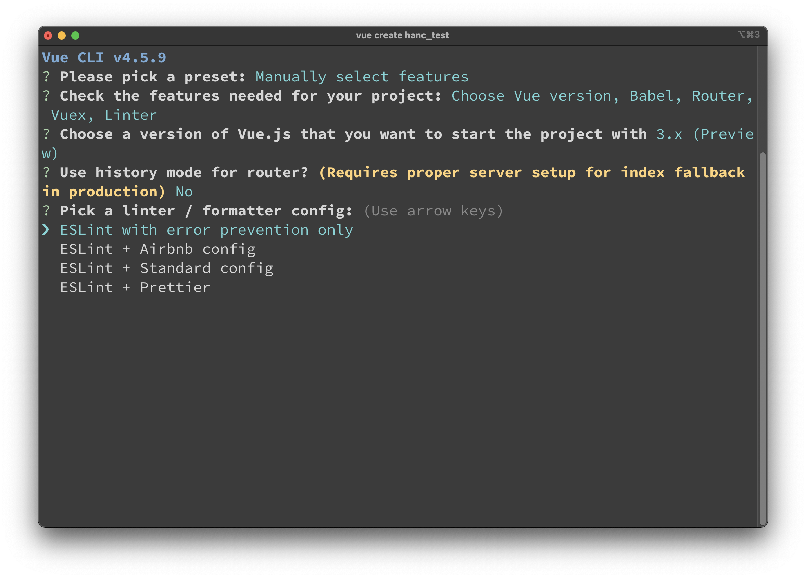

- 擇選 Lint features
> 選擇檢查程式碼的時機   
* Lint on save #存檔時檢查  
* Lint and fix on commit #Git 提交時檢查

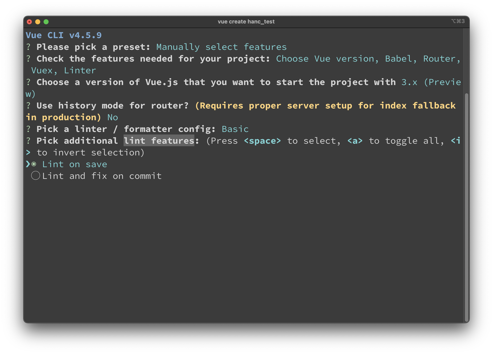

- 擇選配置檔放置位置 - Package.json
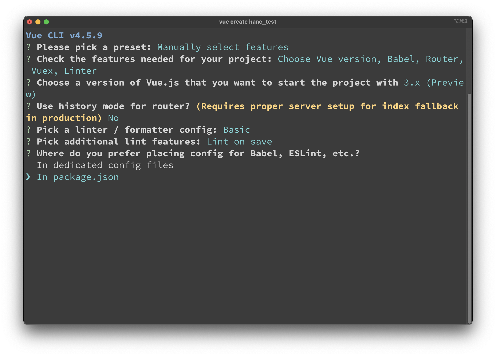

- 最後一步，是否把前面的設定新增為一個預設的項目，下次再產生專案時，就可以不用再一一選擇這些配置。
> 建議第一次建立，可以先創好至少一個Preset
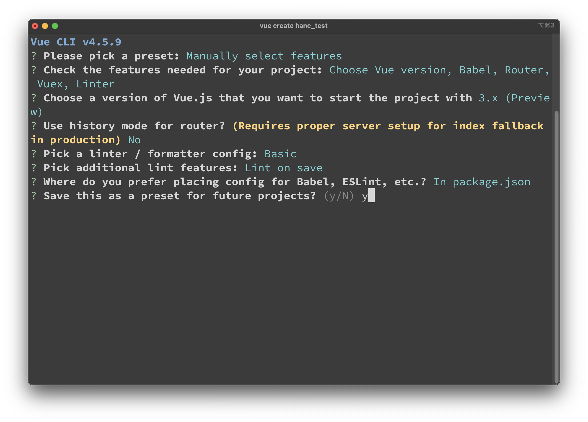

給preset一個名稱，名字可隨意取，只要自己記得這一個preset的設定是什麼即可，以下供參考
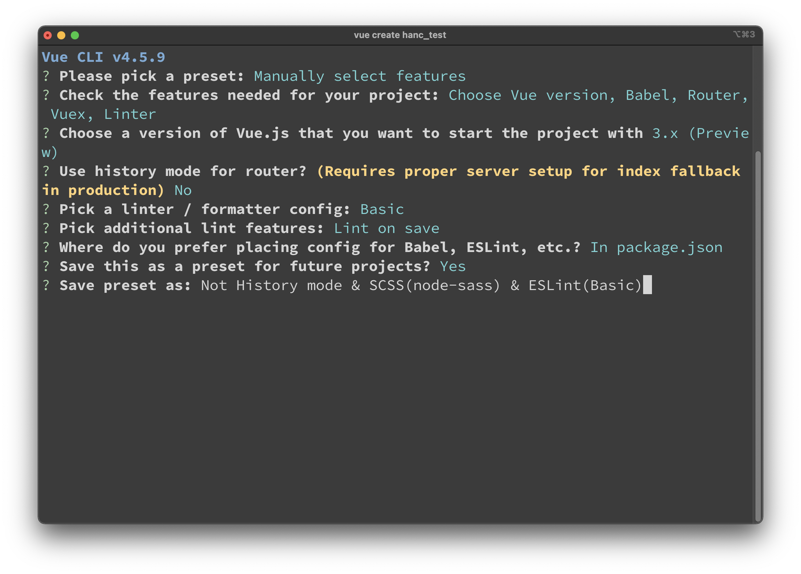

3. 選擇設定後，系統即會開始建立專案，請稍等一小段時間

4. [Vue專案架構](./VueStructure.md)