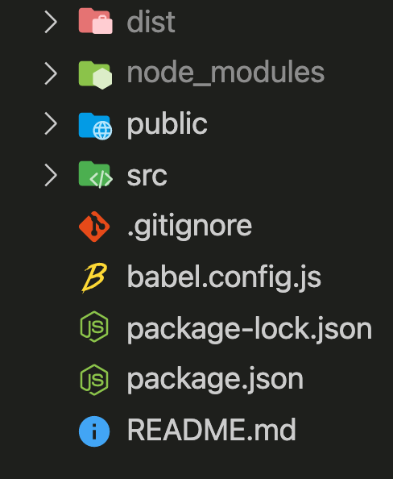

## Vue專案架構

### 專案根目錄

- dist: 欲發佈的網頁資料，即欲發佈之網站
    - 當Vue專案編寫完成，需將其建置為可發佈的HTML格式，執行`npm run build`，即會產生此資料夾
    - 將此資料夾下的內容直接上傳至網頁伺服器，即佈署完成
    - 此資料夾列入`.gitignore`文件中，因其可使用指令產出，無需特別加入版本控制

- node_modules: 專案所需的套件，皆安裝至此資料夾下
    - 此資料夾也被列入`.gitignore`文件中，因為其容量太大，不適合隨意搬移，太浪費時間
    - 於`package.json`也有列表專案所需的套件為哪些，因此一個Vue專案若沒有`node_modules`也沒有關係，可直接執行`npm install`，系統即會根據`package.json`下載所有套件。

- public: 全域圖片、資源存放位置。
    - 像網頁的icon，為整個專案任一頁皆所需，因此需放置於此，供`index.html`直接使用
    - index.html: 整個專案的root檔案

- src: 原始碼 / 靜態資源 / 路徑 / 元件 / …
    - assets: 靜態資源，Ex.圖像、自定義JS、CSS等
    - components: 自定義可重複使用之元件，Ex. 客製化按鈕、NavBar、輸入框、填寫表格…
    - router: 不同頁面間的路徑註冊
    - store: 引入Vuex，是一個state管理工具，強調中心管理，全域變數、函式宣告，且只能透過`mutation`去改變它。
    - views: 頁面製作
    - App.vue: 頁面母板
    - main.js: 程式入口檔案(Entry File)，初始化vue並載入需要的外掛及公共元件

- .gitignore: 寫入此檔的檔案及資料夾名稱，git版本控制時會忽略，不做版本控制

- babel.config.js: babel配置
- package-lock.json: 套件詳細資料
    - 會詳細紀錄，專案所使用的套件其版本及其細項內容
    - 每次 npm install / uninstall /update 都會自動更新
- package.json: 如同專案的身份證
- README.md: 專案說明文檔入口處，協同者皆從此開始了解專案

### 主要程式編輯區
- 主要開發的程式碼會落於`src`資料夾下